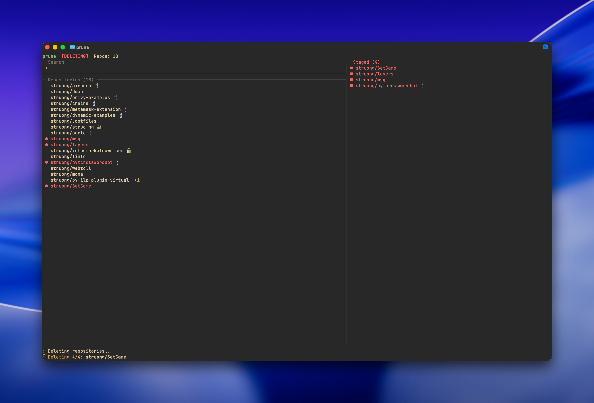

# ghune

Cleaning up repos from the Github UI is tedious. Bulk-delete GitHub repos from the terminal instead!



## Install

```bash
cargo install ghune
```

## Setup

Create a GitHub token at https://github.com/settings/tokens/new with `repo` and `delete_repo` scopes. The tool prompts for it on first run and stores it in your OS keychain.

## Usage

```bash
ghune            # interactive mode
ghune --dry-run  # test without deleting
ghune --logout   # clear stored token
```

## Keybindings

**Search mode:**
- `C-j/k` or arrows — navigate
- `Enter` — stage repo for deletion
- `C-t` — switch to staging mode
- `C-p` — filter private only
- `C-f` — filter forks only
- `C-s` — cycle sort (updated/created/name/stars)
- `C-r` — refresh
- Type to fuzzy search

**Staging mode:**
- `C-j/k` — navigate
- `Backspace` — unstage repo
- `Enter` — delete staged repos
- `C-t` or `Esc` — back to search

## License

MIT
